# YieldSense AI

**Crop Yield Prediction & Agricultural Productivity Intelligence Platform**

YieldSense AI helps farmers, agronomists and agricultural organisations estimate crop yields, understand weather, soil and risk, and act on data-driven recommendations. It combines a leakage-free machine-learning model, a rule-based recommendation and risk engine, real soil and weather data, and a role-aware web application.

This repository covers all four milestones of the project specification: project setup and data pipeline (1), yield prediction and agricultural analysis (2), dashboards, reporting and recommendations (3), and testing, containerisation, cloud deployment and CI/CD (4).

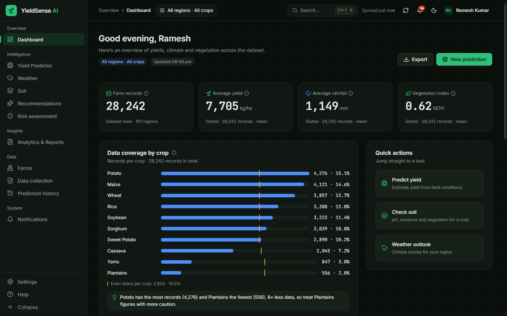

| | |
| --- | --- |
| **Status** | Milestones 1–3 complete ([checklist](docs/milestone-1-3-checklist.md)). Milestone 4 (Docker, cloud deployment, CI/CD, model validation) implemented; cloud deployment waits on account setup ([checklist](docs/milestone-4-checklist.md)) |
| **Served model** | XGBoost v3.0.0 · MAE 884 kg/ha · MAPE 13.6% · R² 0.936 on unseen years (2018–2023) · P10–P90 coverage 81.9% |
| **Stack** | FastAPI · PostgreSQL · MongoDB · React 19 · TypeScript · Vite |
| **Quality** | 130 backend tests · 41 frontend unit tests · 38 browser checks across all three roles (also against the Docker stack) · model validation gate · Lighthouse 99–100 |
| **Deployment** | Docker Compose stack, GitHub Actions CI/CD, AWS or Azure VM with optional HTTPS ([guide](docs/deployment.md)) |

---

## Table of contents

1. [Features](#features)
2. [Roles and access](#roles-and-access)
3. [Architecture](#architecture)
4. [Technology stack](#technology-stack)
5. [Data and provenance](#data-and-provenance)
6. [The yield model](#the-yield-model)
7. [Getting started](#getting-started)
8. [Run with Docker and deploy](#run-with-docker-and-deploy)
9. [Configuration](#configuration)
10. [API overview](#api-overview)
11. [Testing and quality](#testing-and-quality)
12. [Screenshots](#screenshots)
13. [Project structure](#project-structure)
14. [Documentation](#documentation)
15. [Known limitations](#known-limitations)
16. [Roadmap](#roadmap)
17. [Author](#author)

---

## Features

> **New in v3.0:** data to 2023 with real yearly rainfall, a more accurate model with prediction explanations, an AI assistant, satellite crop health, market revenue, leaf-photo disease check, installable app, Indian languages, email/SMS digests, Google sign-in, rate limiting and model monitoring. Details: **[docs/next-level-features.md](docs/next-level-features.md)**.

### Prediction

- **Yield Predictor.** Predicts yield per hectare with a P10–P90 range. The form separates **Model inputs** (crop, region, year, rainfall, temperature, pesticides, plus the country's last-season and 3-season yields, looked up automatically), which drive the estimate, from optional **Field conditions** (soil, irrigation, fertilizer, disease), which only drive risk flags and advice.
- **Harvest estimate.** With a farm selected, the predicted yield is multiplied by the farm's area to give an expected harvest in tonnes, with its range.
- **Why this prediction.** Exact per-input contributions (TreeSHAP) for every prediction.
- **What-if scenarios.** Change rainfall, temperature or pesticide use and see how the estimate moves, without saving to history.
- **Prediction history.** Every prediction is saved on the server. Filter by crop, region or farm, compare two side by side, re-run one with the current model, or delete it.
- **AI insight.** A short explanation written by an LLM (Groq) when available, otherwise by a rule engine. The source is always labelled.

### Farms and data collection

- **Farms.** Create, edit and delete farms with their area, crops, location and irrigation. Each farm has season records, a map, predictions, recommendations and risks.
- **Data collection wizard.** Import CSV or Excel files in three steps: upload, map columns, validate and import. Row-level errors are reported before anything is written.
- **Soil tests.** Record lab results (pH, N, P, K, organic carbon) per farm.

### Weather and soil

- **Weather.** Live 7-day forecast and a yearly climate trend (ERA5 reanalysis) per region, with temperature and precipitation slopes per decade.
- **Real soil per farm.** Soil pH, organic carbon, nitrogen, clay, sand and cation exchange capacity for the farm's location from ISRIC SoilGrids, averaged over 0–30 cm.
- **Nutrient analysis.** Soil-test results are rated Low / Medium / High against Indian Soil Health Card limits, with fertilizer guidance for each nutrient.
- **Crop suitability.** Crops ranked for the farm from its real pH and fertility.

### Recommendations and risk

- **Recommendations.** A rule engine compares the selected context with the conditions of top-yielding records. Each recommendation shows its evidence, a model-estimated impact where one can be estimated, a deadline and a plain-language rationale. Create a task, snooze, dismiss or mark it done; the state is saved per user.
- **Risk assessment.** A likelihood × impact matrix, a yearly timeline, yield anomalies (more than 3σ from the crop mean) and mitigation advice. Drought, flood and heat use each year’s country weather.
- **Notifications.** A bell with an unread count and a notifications page for high-priority alerts.

### AI, satellite and market (v3.0)

- **Ask YieldSense.** A chat assistant (Groq LLM) that answers from your own farms, predictions, risks and tasks, in any language.
- **Satellite crop health.** NASA MODIS NDVI for each farm over the last 12 months, compared with the year before.
- **Market & revenue.** Expected gross revenue per hectare for each crop: next-season model yield × FAOSTAT producer price.
- **Leaf check.** Photograph a leaf and get a first check for 38 diseases of 14 plants (MobileNetV2, ONNX) with treatment guidance.
- **For farmers in the field.** Installable app with an offline shell, menus in Hindi, Kannada, Telugu and Tamil, weekly digests by email or SMS/WhatsApp, and Google sign-in.

### Analytics and reporting

- **Dashboard.** Headline figures, crop portfolio, data coverage and the top recommendations.
- **Analytics.** Yearly yield trend with a next-year forecast band, growth rates, record comparison, and your farms against the regional reference.
- **Reports.** CSV and Excel export, a printable prediction report, and a printable productivity report scoped to the current context.
- **Exploratory data analysis** and a searchable **Dataset Explorer** with a provenance badge on every column.

### Model transparency and administration

- **Model performance.** Every model, target and evaluation split from the model card, the selection rule, held-out interval coverage, a weather-feature ablation, a before/after version comparison and permutation importance.
- **Administration.** Users and roles, an audit log, and system metrics: API and inference latency (p50/p95), recommendation effectiveness and data processing speed.

A global context bar (**Farm · Region · Crop · Year**) applies to every screen and is kept in the URL, so any view can be bookmarked or shared. The interface supports light and dark themes and works from 360 px to desktop widths.

---

## Roles and access

| Role | Can use |
| --- | --- |
| **Farmer** | Dashboard, Predictor, history, farms, data collection, weather, soil, recommendations, risk, analytics, notifications, settings |
| **Agronomist** | Everything a farmer can, plus EDA, Dataset Explorer, Model performance, reference-data imports, and all users' farms and predictions |
| **Admin** | Everything, plus users and roles, the audit log and system metrics |

Access is enforced on the server for every route and mirrored in the client's navigation and route guards.

---

## Architecture

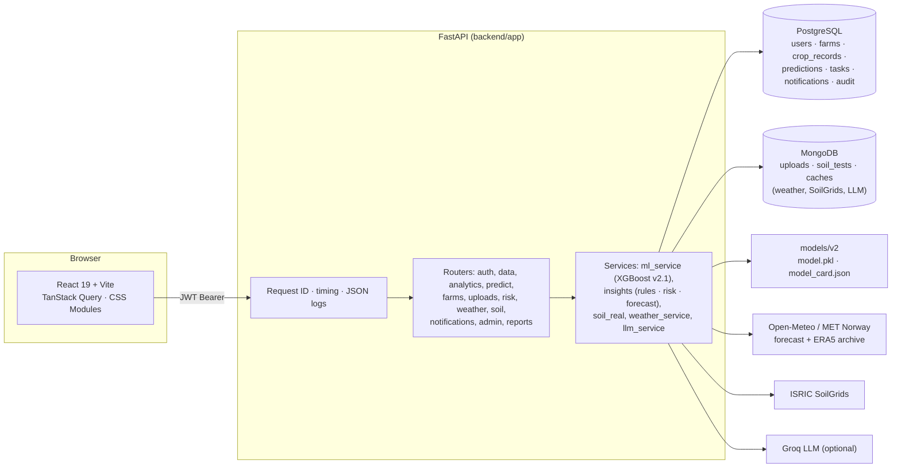

**Design decisions**

- **Two databases, by purpose.** PostgreSQL holds relational data that needs integrity and queries (users, farms, records, predictions, tasks, audit). MongoDB holds raw uploads, soil tests and time-limited caches for external services.
- **One error format and one pagination format.** Every error is `{"error": {"code", "message"}}`; every list is `{items, total, page, page_size}`.
- **Typed client.** The frontend's API types are generated from the backend's OpenAPI schema (`npm run gen:api`), so the two cannot drift silently.
- **External services fail visibly.** If SoilGrids, Open-Meteo or Groq is unavailable, the app shows an error or a clearly labelled fallback. It never substitutes synthetic values for real ones.
- **Security.** JWT access tokens (60 minutes), bcrypt password hashes, rate-limited sign-in and password change, a CORS allow-list, upload validation by content as well as extension, and a required `SECRET_KEY` in production.
- **Observability.** Every response carries `X-Request-ID` and `Server-Timing`; every request writes one structured JSON log line; `/api/health` checks PostgreSQL, MongoDB and the model.

More detail: [docs/system_architecture.md](docs/system_architecture.md) · [docs/database-schema.md](docs/database-schema.md) · [docs/ui_layout.md](docs/ui_layout.md).

---

## Technology stack

| Layer | Technology |
| --- | --- |
| Frontend | React 19, TypeScript 6, Vite 8, React Router 7, TanStack Query 5, Recharts, Leaflet, Radix UI, Zod, CSS Modules with design tokens |
| Backend | Python 3.12, FastAPI, Pydantic 2, SQLAlchemy 2, Alembic, PyJWT, bcrypt |
| Databases | PostgreSQL 16+ (psycopg 3), MongoDB 7+ (PyMongo) |
| Machine learning | scikit-learn, XGBoost (served); LightGBM and TensorFlow/Keras (training and comparison only) |
| External data | FAOSTAT, CRU TS (World Bank CCKP), Open-Meteo + MET Norway, NASA MODIS (ORNL DAAC), ISRIC SoilGrids 2.0, Groq (optional LLM) |
| Tooling | pytest, Vitest, oxlint, Prettier, openapi-typescript, Lighthouse, a Chrome DevTools Protocol browser test |

---

## Data and provenance

The reference dataset (v3, `scripts/build_dataset_v3.py`) has **19,834 rows**: one per country, crop and year, covering 101 countries, 10 crops and **1990–2023**. Yields and pesticides come from FAOSTAT; rainfall and temperature are CRU TS 4.08 country averages **for each year** (World Bank Climate Change Knowledge Portal). The v2 dataset (Kaggle "Crop Yield Prediction", 28,242 rows to 2013) had a single long-term rainfall value per country.

| Provenance | Columns | Used by the model |
| --- | --- | --- |
| **Real** | Region, crop, year, yield, rainfall, temperature, pesticides | Yes (yield is the target) |
| **Synthetic** | Soil pH, soil moisture, humidity, sunlight, irrigation, fertilizer, disease status, crop duration | No |
| **Derived** | NDVI (computed from the yield's own rank), record ID, sowing and harvest dates | No |

Two facts about the real columns matter when reading results:

- **Rainfall and temperature are country averages for each year.** They vary year to year (since v3), so drought and flood are yearly risks; they are still country-wide values, not field weather.
- **Yields are national averages.** A prediction for a farm is the national expectation for that crop and year, not a field-level forecast.

The provenance of every column is served by `GET /api/data/provenance` and shown as **R / S / D** badges in the Dataset Explorer, on Model performance and in the soil tables.

**Real soil data** for farms does not come from the dataset. It is fetched from ISRIC SoilGrids for the farm's coordinates (or the nearest point with data, which the page states) and combined with the farm's own soil tests.

---

## The yield model

`scripts/train_models_v2.py` trains six model families (Linear, Ridge, Random Forest, XGBoost, LightGBM and a Keras MLP) on raw and log-transformed targets and evaluates each on three splits:

| Split | What it tests |
| --- | --- |
| **Temporal** (primary) | Train on 1990–2017, test on 2018–2023: forecasting years the model has not seen |
| Random 80/20 | Interpolation within the data |
| Unseen regions | 20% of countries held out entirely |

**Selection rule (v3).** The served model has the lowest MAE on the temporal split among models the API runtime can serve (Linear, Ridge, Random Forest, XGBoost) with p95 latency ≤ 20 ms; ties within 1% go to the lower RMSE. MAE is used because RMSE is dominated by a few very high-yield root crops. LightGBM and the Keras MLP are evaluated but not served.

**Served model: XGBoost v3.0.0 (log1p target), eight inputs**: crop, region, year, rainfall, temperature, pesticides, and the country's previous-season and 3-season mean yield (known before the season starts).

| Version (its own temporal test) | R² | RMSE (kg/ha) | MAE (kg/ha) | MAPE | P10–P90 coverage |
| --- | --- | --- | --- | --- | --- |
| XGBoost v3.0.0 (served), 2018–2023 | 0.936 | 2,587 | 884 | 13.6% | 81.9% |
| XGBoost v2.1.0 (previous), 2009–2013 | 0.953 | 2,065 | 1,099 | 20.3% | 74.5% |

The typical error fell by 20% (MAE) and 33% (MAPE) and the interval now meets its 80% target. RMSE is higher because the v3 test is harder (six years ahead, higher recent yields).

**What was removed, and why**

- **NDVI** was generated from the yield's own percentile rank. Using it would leak the answer into the inputs.
- **Crop duration (`total_days`)** was a fixed number per crop plus random noise, so it only repeated the crop. Removing it in v2.1 slightly improved every metric.
- The other synthetic columns showed no signal in a permutation-importance test.

**Prediction interval.** The P10–P90 range uses split-conformal residuals. Calibrated on 2018–2019 and checked on 2020–2023, it contains 81.9% of actual yields against a target of 80% (mean width 3,173 kg/ha).

**Weather-feature ablation** (temporal split): removing temperature raises RMSE by 13 kg/ha; removing rainfall raises it by 131 kg/ha. Temperature contributes little, and rainfall acts as a country-level signal.

The full evaluation is in [`models/v2/model_card.json`](models/v2/model_card.json) and on the Model performance page.

---

## Getting started

These steps are for Windows with PowerShell. The commands are the same on macOS and Linux apart from the virtual-environment activation and `copy`.

### Prerequisites

- Python 3.12
- Node.js 20 or later
- PostgreSQL 16 or later
- MongoDB Community 7 or later

### 1. Databases

Install PostgreSQL and MongoDB (both run as Windows services), then create the application role and databases using the `postgres` superuser password you chose at install:

```powershell
$psql = "C:\Program Files\PostgreSQL\18\bin\psql.exe"
& $psql -h 127.0.0.1 -U postgres -c "CREATE ROLE yieldsense LOGIN PASSWORD 'choose-a-password';"
& $psql -h 127.0.0.1 -U postgres -c "CREATE DATABASE yieldsense OWNER yieldsense;"
& $psql -h 127.0.0.1 -U postgres -c "CREATE DATABASE yieldsense_test OWNER yieldsense;"
```

### 2. Backend

```powershell
python -m venv .venv; .\.venv\Scripts\activate
pip install -r requirements.txt -r requirements-dev.txt   # API runtime and tests (no TensorFlow)
copy backend\.env.example backend\.env                    # set DATABASE_URL, TEST_DATABASE_URL, SECRET_KEY
copy .env.example .env                                    # optional: GROQ_API_KEY for AI text
alembic -c backend/alembic.ini upgrade head               # create the schema
python scripts/seed.py                                    # reference data, demo users and farms, caches
python -m uvicorn backend.app.main:app --port 8000
```

- Interactive API documentation: http://localhost:8000/docs
- Health check: http://localhost:8000/api/health

`scripts/seed.py` loads the 19,834 reference rows (and replaces them automatically when the dataset file changes), creates the demo users and three demo farms, creates the MongoDB indexes, and pre-loads SoilGrids data for the demo farms so the demo does not depend on that service's response time.

### 3. Frontend

```powershell
cd frontend
npm install
copy .env.example .env.local      # VITE_API_URL=http://localhost:8000
npm run dev                       # http://localhost:5173
```

### Demo accounts

| Role | Username | Password |
| --- | --- | --- |
| Farmer | `farmer` | `farmer123` |
| Agronomist | `agronomist` | `agro123` |
| Admin | `admin` | `admin123` |

They are also available as one-click buttons on the sign-in page. Change or remove them before any real deployment.

### Retraining the model (optional)

```powershell
pip install -r requirements-train.txt   # adds TensorFlow, LightGBM and plotting libraries
python scripts/train_models_v2.py       # writes models/v2/model.pkl and model_card.json
```

---

## Run with Docker and deploy

The whole stack (PostgreSQL, MongoDB, API and web) runs with Docker Compose. Nginx serves the web app and forwards `/api` to the API, so everything is on one address.

```powershell
copy .env.docker.example .env.docker      # set SECRET_KEY and POSTGRES_PASSWORD
docker compose --env-file .env.docker up -d --build
# open http://localhost   (API docs: http://localhost/docs)
```

The first start creates the schema and loads the data (about two minutes). To avoid repeating `--env-file`, set `$env:COMPOSE_ENV_FILES = ".env.docker"` in the terminal. For HTTPS with your own domain, add `--profile tls` (Caddy obtains the certificate automatically).

Verified locally with Docker Desktop: all services healthy, the browser test passes (38/38), and 20 concurrent users get 72 requests/s with p95 507 ms and no errors.

**Cloud deployment.** The project deploys to one Ubuntu virtual machine on **AWS EC2** or **Azure**. `deploy/server-setup.sh` prepares the machine once. After that, the GitHub Actions *Deploy* workflow:

1. builds both images and pushes them to GitHub Container Registry;
2. copies the Compose files to the server and restarts the stack;
3. checks `/api/health`.

**CI.** Every push runs the backend tests, the model validation gate, the frontend checks and a Docker build. Pushes also start the full stack and run the browser test and a load test against it.

Step-by-step instructions (VM creation on AWS and Azure, GitHub secrets, HTTPS, backups, rollback, troubleshooting) are in **[docs/deployment.md](docs/deployment.md)**.

**Free deployment, no credit card:** one container on a free Render web service (`render.yaml` Blueprint) with Neon PostgreSQL and MongoDB Atlas. Live demo: **https://yieldsense-ai-hilr.onrender.com** (it sleeps when idle; the first visit can take about a minute). See **[docs/deployment-free.md](docs/deployment-free.md)**.

| Script | Purpose |
| --- | --- |
| `scripts/validate_model.py` | Model validation gate: out-of-time accuracy, interval coverage, feature integrity, latency; exit code 1 below the thresholds |
| `scripts/load_test.py` | Concurrent load test with throughput and latency percentiles |
| `scripts/create_admin.py` | Creates the first administrator when demo accounts are disabled (`SEED_DEMO_DATA=false`) |
| `deploy/backup.sh` | PostgreSQL and MongoDB backups with 14-day retention |

---

## Configuration

Backend settings are read from `backend/.env` (see [`backend/.env.example`](backend/.env.example)); the repository-root `.env` is also read for the LLM keys. Neither file is committed.

| Variable | Purpose | Default |
| --- | --- | --- |
| `APP_ENV` | `development` or `production`. Production refuses to start without `SECRET_KEY` | `development` |
| `SECRET_KEY` | JWT signing secret, at least 32 characters. Generate with `python -c "import secrets; print(secrets.token_urlsafe(48))"` | Random per process in development |
| `DATABASE_URL` | PostgreSQL connection (SQLAlchemy URL, psycopg 3) | local `yieldsense` database |
| `TEST_DATABASE_URL` | Database used by pytest; it is truncated and re-seeded on every run | none |
| `MONGO_URL`, `MONGO_DB` | MongoDB connection and database name | `mongodb://127.0.0.1:27017`, `yieldsense` |
| `CORS_ORIGINS` | Comma-separated browser origins allowed to call the API | `http://localhost:5173` |
| `ACCESS_TOKEN_EXPIRE_MINUTES` | Session length | `60` |
| `LOGIN_MAX_FAILURES`, `LOGIN_WINDOW_SECONDS` | Sign-in rate limit | `5` per `60` s |
| `UPLOAD_MAX_BYTES`, `UPLOAD_MAX_ROWS` | Upload limits | 10 MB, 50,000 rows |
| `MODEL_DIR` | Folder with `model.pkl` and `model_card.json` | `models/v2` |
| `GROQ_API_KEY`, `GROQ_MODEL` | Optional LLM for insights and rationales | none, `openai/gpt-oss-20b` |
| `VITE_API_URL` (frontend) | Base URL of the API | `http://localhost:8000` |

---

## API overview

The API has 60 operations. Every route except sign-in, registration, health and public statistics requires a Bearer token.

| Group | Base path | Purpose |
| --- | --- | --- |
| Auth | `/api/auth` | Sign in, register, profile, change password |
| Data | `/api/data` | Dataset records, summary, sample record, column provenance |
| Analytics | `/api/analytics` | EDA metrics and charts, trends and forecast, comparisons |
| Prediction | `/api/predict`, `/api/predictions` | Predict, what-if, insights, model card, recommendations hub, history |
| Recommendations | `/api/recommendations` | Task actions and task list |
| Farms | `/api/farms`, `/api/soil-tests` | Farms, season records, real soil, soil tests |
| Uploads | `/api/uploads` | Upload, validate and import CSV/XLSX files |
| Weather and soil | `/api/weather`, `/api/soil` | Forecast, climate trend, dataset soil view |
| Risk | `/api/risk` | Risk matrix, timeline, anomalies |
| Notifications | `/api/notifications` | List, mark read |
| Reports | `/api/reports` | CSV and Excel export |
| Admin | `/api/admin` | Users, audit log, system metrics |
| System | `/api/health`, `/api/public/stats` | Health check, public aggregate statistics |

The complete reference is the Swagger UI at `/docs`. A Postman collection is provided at [docs/YieldSense.postman_collection.json](docs/YieldSense.postman_collection.json).

---

## Testing and quality

| Command | What it checks | Latest result |
| --- | --- | --- |
| `python -m pytest backend/tests -q` | API behaviour, access for every route and role, model and provenance, uploads, soil, LLM wording, observability, admin bootstrap | 130 passed |
| `python scripts/validate_model.py` | Model validation gate (refit on 1990–2017, score 2018–2023) | Passed: R² 0.9415, RMSE 2,481, MAE 857 kg/ha, coverage 0.819, p95 8 ms |
| `python scripts/load_test.py --base <url>` | 10 concurrent users for 20 s against the local API | 66 req/s, p95 249 ms, 0 errors |
| `cd frontend; npx tsc -b --noEmit` | Type checking | Clean |
| `npx oxlint src` · `npx prettier --check src` | Lint and formatting | Clean |
| `npx vitest run` | Unit tests | 41 passed |
| `npm run build` | Production build | Succeeds |
| `npm run test:e2e` | Headless browser test for all three roles; fails on any console error | 38 checks passed, 0 console errors |
| `npm run lighthouse` | Lighthouse, desktop and mobile, on `/`, `/login`, `/app/dashboard` | Performance 99–100; accessibility, best practices and SEO 100 |

Notes:

- The backend tests use the `yieldsense_test` database and mock external services (SoilGrids, Groq), so they run offline.
- The browser test and Lighthouse need the API and the app running. They use Microsoft Edge by default; set `BROWSER_PATH` to use another Chromium-based browser.

---

## Screenshots

| | |
| --- | --- |
| 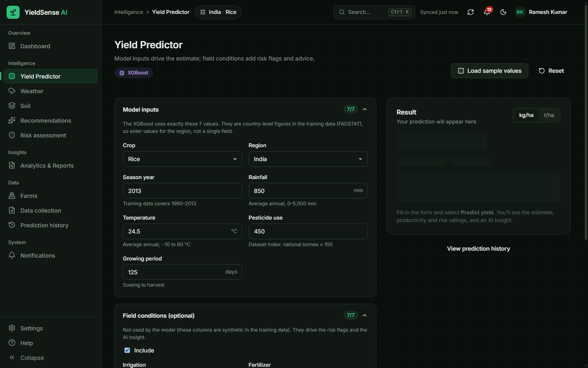 **Yield Predictor** | 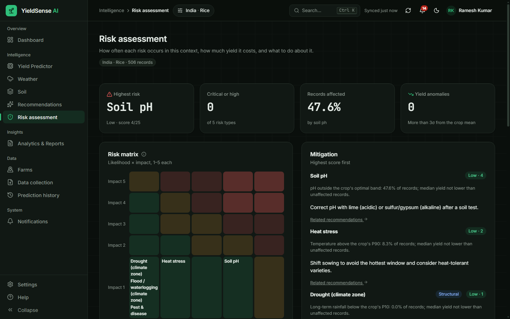 **Risk assessment** |
| 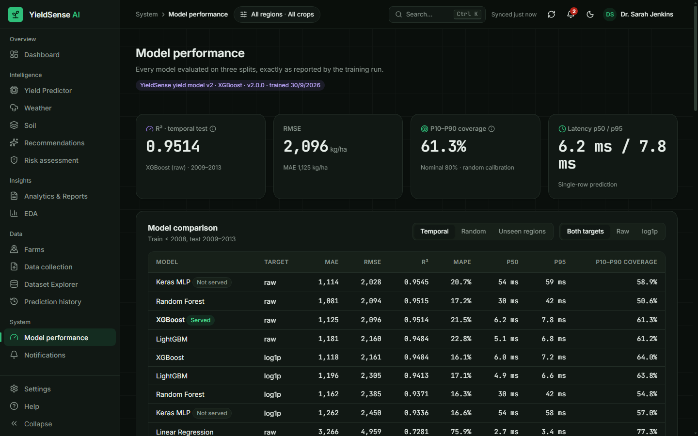 **Model performance** | 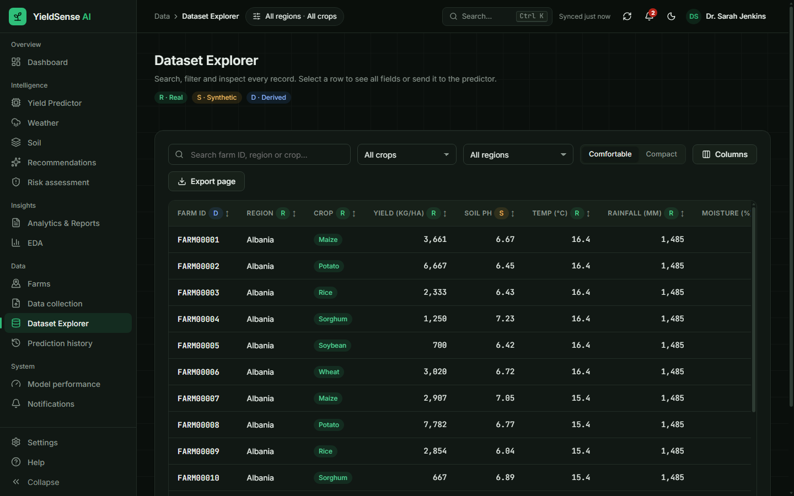 **Dataset Explorer** |
| 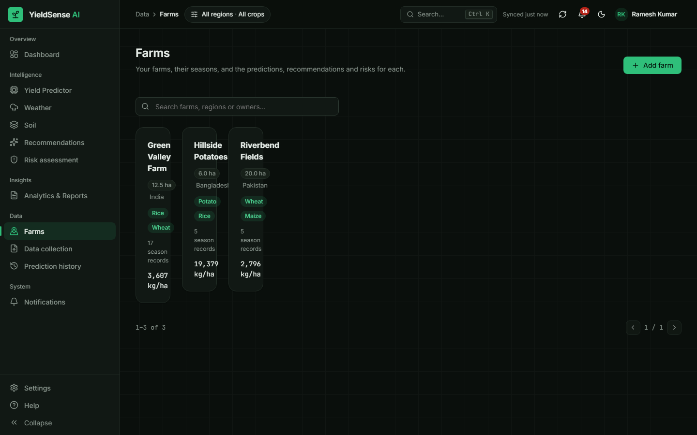 **Farms** | 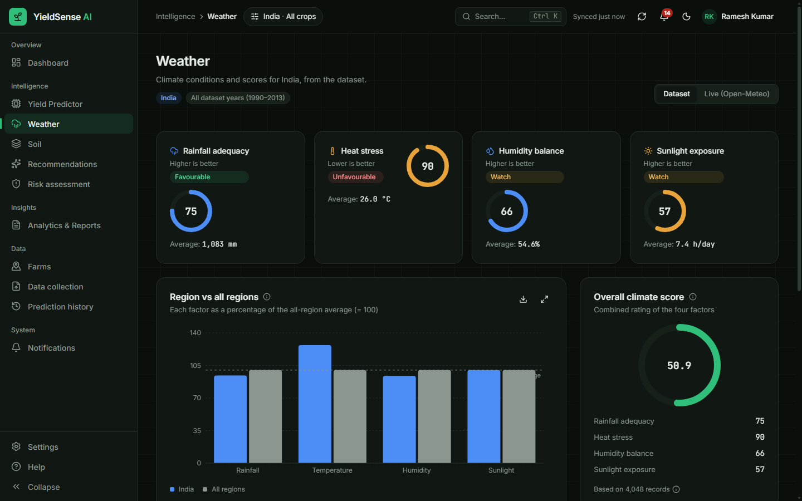 **Weather** |
| 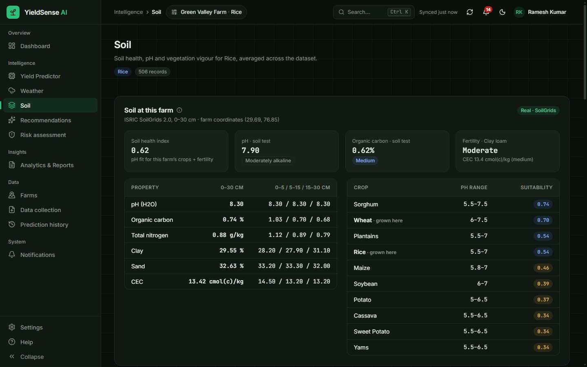 **Real soil for a farm** | 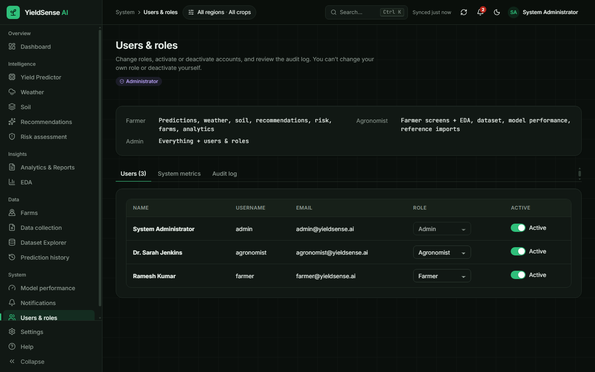 **Users and roles** |
| 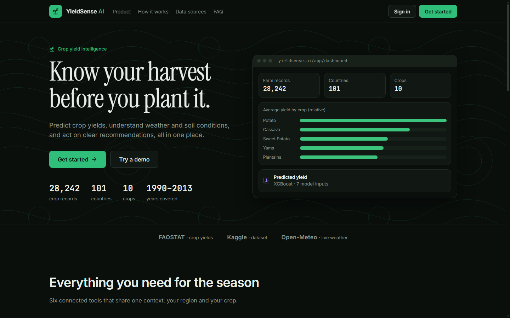 **Landing page** | |

---

## Project structure

```text
backend/
  Dockerfile        API image; docker-entrypoint.sh waits for the databases, migrates and seeds
  app/
    api/            Routers: auth, data, analytics, predictions, management (farms, soil),
                    uploads, domain (risk, weather, soil, notifications, admin), reports
    services/       ml_service, insights, soil_real, weather_service, llm_service, store, dataset
    core/           config, security, errors, agronomy rules, provenance, rate limit, observability
    db/             SQLAlchemy models, session, MongoDB helpers
  migrations/       Alembic migrations (schema, weather observations, query indexes)
  tests/            pytest suite and fixtures
frontend/
  Dockerfile        Web image; nginx.conf serves the app and proxies /api
  src/
    pages/          Public pages and application screens
    components/     UI kit, charts, application shell, farm map, soil panel
    api/            HTTP client, endpoints, types generated from OpenAPI
    hooks/ store/   Data hooks, URL-based context filters, preferences
    styles/         Design tokens and global styles
  e2e/              Browser test and Lighthouse scripts
scripts/            Preprocessing, EDA, seed, model training and validation, load test, admin bootstrap
deploy/             Server setup, Caddy (HTTPS) and backup scripts
.github/workflows/  CI and Deploy pipelines
docker-compose.yml  Full stack; docker-compose.prod.yml runs the registry images
models/v2/          Served model bundle and model card
datasets/           Raw and processed data, SoilGrids snapshot for the demo farms
docs/               Specification, architecture, schema, checklist, Postman collection, screenshots
```

---

## Documentation

| Document | Contents |
| --- | --- |
| [Milestone 1–3 checklist](docs/milestone-1-3-checklist.md) | Every requirement with its status, evidence, measured metrics, limitations and deviations from the specification |
| [Milestone 4 checklist](docs/milestone-4-checklist.md) | Testing, deployment and documentation status, and what has to be set up |
| [Deployment guide](docs/deployment.md) | Docker, AWS/Azure VM, HTTPS, CI/CD, backups, rollback and troubleshooting |
| [Free deployment guide](docs/deployment-free.md) | Render + Neon + MongoDB Atlas, step by step, no credit card |
| [Next-level features](docs/next-level-features.md) | v3.0: data to 2023, explanations, assistant, satellite, market, leaf check, PWA, languages, digests, Google sign-in, monitoring |
| [Final presentation](docs/presentation/YieldSense_AI_Final_Presentation.pptx) | 15 slides with speaker notes |
| [Demo script](docs/demo-script.md) | A tested 8-minute path through the platform for all three roles |
| [System architecture](docs/system_architecture.md) | Components, data flow and services |
| [Database schema](docs/database-schema.md) | Entity-relationship diagram and MongoDB collections |
| [UI layout](docs/ui_layout.md) | Application shell, screens and design system |
| [Project specification](docs/YieldSense_AI_Project_Specification.md) | The original requirements |
| [Model card](models/v2/model_card.json) | Full model evaluation |

The Milestone 1 and Milestone 2 reports in `docs/` describe the first version of the system and are marked as superseded.

---

## Known limitations

1. **Country-level model.** Predictions are national expectations per crop and year, not field-level forecasts.
2. **No extrapolation.** Tree models hold the last training year's level, so seasons after 2013 are predicted at the 2013 level.
3. **Rainfall is constant per country** in the dataset, so there is no year-to-year rainfall effect.
4. **The prediction range is slightly narrow:** 74.5% coverage on held-out years against a target of 80%.
5. **Synthetic columns.** Humidity, sunlight, irrigation, fertilizer, disease and the dataset's soil columns were generated, not measured. They are labelled as such and are not used by the model.
6. **SoilGrids** is a global model at 250 m resolution, not a field measurement. Its public API is slow and sometimes unavailable, and it has no data for urban areas or water.
7. **Nutrient rating limits.** The Soil Health Card limits for phosphorus and potassium are applied as elemental values, with oxide equivalents shown; some state charts use slightly different limits.
8. **Recommendation outcomes** cannot yet be measured: that needs several recorded seasons per farm after tasks are completed.

Deviations from the specification (CSS Modules instead of Tailwind, React with Vite instead of Next.js, yearly instead of seasonal analysis, and others) are listed with reasons in the [checklist](docs/milestone-1-3-checklist.md#deviations-from-spec).

---

## Roadmap

Done in Milestone 4: Docker images and Compose stack, GitHub Actions CI/CD, cloud deployment to an AWS or Azure VM, a model validation gate and a load test.

Next steps:

- Run the first cloud deployment and record the production load-test results.
- Move the databases to managed services (Amazon RDS / Azure Database for PostgreSQL, MongoDB Atlas) for automatic backups and failover.
- Add error tracking and uptime monitoring with alerts.
- Add harvested-area and production data, and field-level data, to move beyond national averages.

---

## Author

- **Name:** Durga Prasad A
- **Branch:** `DURGA-PRASAD-A`
- **Repository:** `springboardmentor12233a-tech/-AI-Powered-Crop-Yield-Prediction-and-Agricultural-Productivity-Intelligence-Platform`
