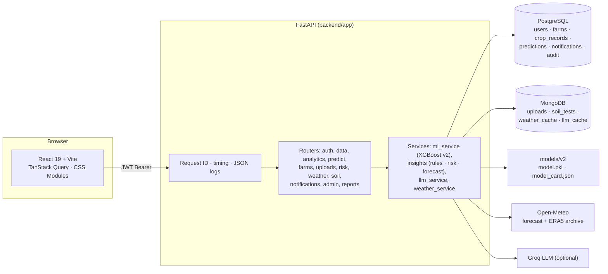

# YieldSense AI — Crop Yield Prediction & Agricultural Productivity Intelligence

YieldSense AI helps farmers, agronomists and administrators estimate crop yields, understand weather, soil and risk, and act on recommendations. Milestones 1–3 cover the data pipeline, the leakage-free yield model, and the full web platform: FastAPI with PostgreSQL and MongoDB on the backend, and React on the frontend.

What is and isn't done is tracked in [docs/milestone-1-3-checklist.md](docs/milestone-1-3-checklist.md).


## What's inside

| Area | What it does |
| --- | --- |
| Yield Predictor | XGBoost model v2 with a P10–P90 range. The form is split into **Model inputs** (crop, region, year, rainfall, temperature, pesticides, growing period) and optional **Field conditions**, which drive risk flags only. Includes what-if scenarios. |
| Prediction history | Saved on the server. Filter, compare two predictions, re-run with the current model, delete. |
| Farms & data collection | Farms CRUD, seasons, map, soil tests. A CSV/XLSX import wizard (upload → map → validate → import). |
| Recommendations | Rule engine with model-estimated impact. The rationale is written live by Groq when available and labelled as a rule-based fallback otherwise. Tasks, snooze and dismiss are saved. |
| Risk assessment | Likelihood × impact matrix, yearly timeline, yield anomalies (>3σ), mitigation. |
| Analytics & reports | Yearly trend with next-year forecast band, your farms vs regional reference, CSV/XLSX export, printable report at `/report/productivity`. |
| Weather & soil | Live 7-day Open-Meteo forecast, yearly ERA5 climate trend, optimal bands for every soil/climate metric. |
| Model performance | 6 models × 2 targets × 3 splits from the model card, selection rule, interval coverage, permutation importance, column provenance. |
| Notifications | Bell with unread count and a notifications page for risk alerts and high-priority recommendations. |
| Admin | Users & roles, audit log, system metrics (API and inference p50/p95). |

Global context (Farm · Region · Crop · Year) lives in the URL and applies to every screen.

## Architecture



- **Auth:** JWT that expires after 60 minutes, bcrypt password hashes, and a login rate limit. Three roles (Farmer, Agronomist, Admin), enforced on both the server and the client. Every `/api` route except login, register, health and public stats requires a token, and a test checks every route in the OpenAPI schema.
- **Data:** `crop_records` holds the reference dataset (28,242 FAOSTAT country · crop · year rows, 1990–2013). Only crop, region, year, yield, rainfall, temperature and pesticides are real. The soil, humidity, sunlight, irrigation, fertilizer, disease and crop-duration columns are synthetic, and NDVI is derived from yield. `GET /api/data/provenance` and the UI badges show this for every column.
- **Model:** `scripts/train_models_v2.py` trains Linear, Ridge, RF, XGBoost, LightGBM and a Keras MLP on raw and log1p targets, and evaluates them on random, temporal (train ≤ 2008 / test 2009–2013) and unseen-region splits. The served model has the lowest temporal RMSE; models within 1% count as tied and the lower p95 latency wins. The P10–P90 interval uses split-conformal residuals from the out-of-time period.
- **Observability:** every response carries `X-Request-ID` and `Server-Timing`, and every request writes one JSON log line. `GET /api/health` checks PostgreSQL, MongoDB and the model. `GET /api/admin/metrics` reports rolling p50/p95 latency per route and for inference.

Schema and ERD: [docs/database-schema.md](docs/database-schema.md).

## Setup (Windows)

### 1. Databases

1. Install PostgreSQL 16+ (EDB installer) and MongoDB Community 7+ (MSI, "Install as a Service").
2. Create the app role and databases, using the `postgres` superuser password you chose at install:
   ```powershell
   $psql = "C:\Program Files\PostgreSQL\18\bin\psql.exe"
   & $psql -h 127.0.0.1 -U postgres -c "CREATE ROLE yieldsense LOGIN PASSWORD 'choose-a-password';"
   & $psql -h 127.0.0.1 -U postgres -c "CREATE DATABASE yieldsense OWNER yieldsense;"
   & $psql -h 127.0.0.1 -U postgres -c "CREATE DATABASE yieldsense_test OWNER yieldsense;"
   ```

### 2. Backend

```powershell
python -m venv .venv; .\.venv\Scripts\activate
pip install -r requirements.txt -r requirements-dev.txt
copy backend\.env.example backend\.env    # set DATABASE_URL, TEST_DATABASE_URL, SECRET_KEY
copy .env.example .env                    # optional: GROQ_API_KEY for AI rationale text
alembic -c backend/alembic.ini upgrade head
python scripts/seed.py                    # reference dataset, demo users and farms, Mongo indexes
python -m uvicorn backend.app.main:app --port 8000
```

- API docs: http://localhost:8000/docs
- Health: http://localhost:8000/api/health
- Generate `SECRET_KEY` with `python -c "import secrets; print(secrets.token_urlsafe(48))"`. With `APP_ENV=production` the API refuses to start without one.
- To retrain the model, run `python scripts/train_models_v2.py`. It writes `models/v2/model.pkl` and `model_card.json`.

### 3. Frontend

```powershell
cd frontend
npm install
copy .env.example .env.local              # VITE_API_URL=http://localhost:8000
npm run dev                               # http://localhost:5173
```

Demo accounts: `farmer / farmer123`, `agronomist / agro123`, `admin / admin123`. They are also available as one-click buttons on the sign-in page.

## Checks

| Command | What it runs |
| --- | --- |
| `python -m pytest backend/tests -q` | API, access matrix for every route and role, model/provenance, uploads, observability (uses `yieldsense_test`) |
| `cd frontend; npx tsc -b --noEmit` | Typecheck |
| `npx oxlint src` · `npx prettier --check src` | Lint and format |
| `npx vitest run` | Unit tests (selectors, filters, formatting, notifications) |
| `npm run build` | Production build |
| `npm run test:e2e` | Headless Edge browser test over CDP for all three roles; fails on any console error (API + app must be running) |
| `npm run lighthouse` | Lighthouse desktop + mobile on `/`, `/login`, `/app/dashboard` against `vite preview` |

## Screenshots

| | |
| --- | --- |
|  |  |
|  |  |
|  |  |
|  |  |

## Repository layout

```text
backend/app/        FastAPI app: api/ (routers), services/, core/ (config, security, rules, provenance, observability), db/
backend/migrations/ Alembic migrations (0001 schema, 0002 weather observations, 0003 query indexes)
backend/tests/      pytest suite
frontend/src/       React app: pages/, components/, api/ (typed client from OpenAPI), hooks/, store/
frontend/e2e/       Browser (CDP) and Lighthouse scripts
scripts/            preprocess, EDA, seed, train_models_v2, legacy migration
models/v2/          Served model bundle and model card
datasets/           Raw and processed data
docs/               Specs, schema, milestone checklist, screenshots
```

## 👤 Author & Branch Information

- **Branch:** `DURGA-PRASAD-A`
- **Repository:** `springboardmentor12233a-tech/-AI-Powered-Crop-Yield-Prediction-and-Agricultural-Productivity-Intelligence-Platform`
