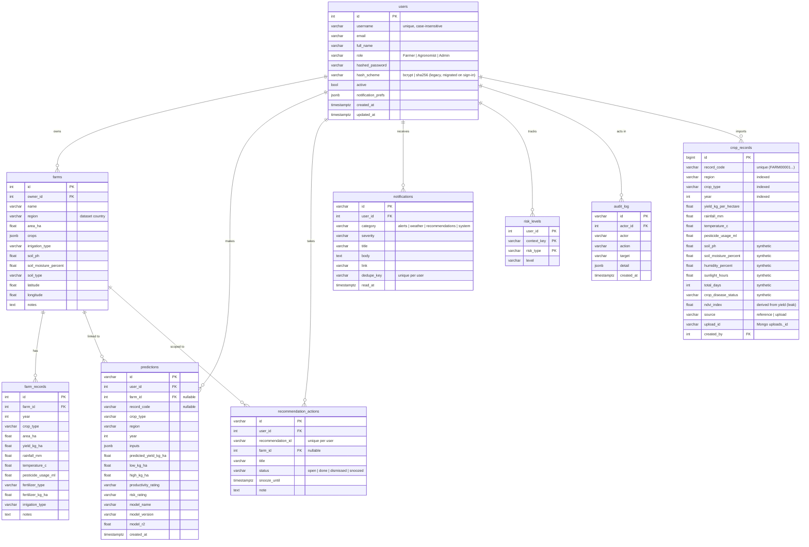

# YieldSense database schema

YieldSense uses **PostgreSQL** for relational, transactional data and **MongoDB** for raw documents and caches.
Migrations: `alembic -c backend/alembic.ini upgrade head` (see `backend/migrations`).

## PostgreSQL

Indexes worth knowing: `crop_records(region)`, `(crop_type)`, `(year)`, `(region, crop_type, year)`; `predictions(user_id, created_at)`;
`notifications(user_id, created_at)`; `farm_records(farm_id, year)`; unique `lower(users.username)`.

## MongoDB (`MONGO_DB`)

| Collection | Contents | Indexes |
|---|---|---|
| `uploads` | Raw uploaded rows, column mapping, validation report, import summary | `created_at`, `(user, created_at)` |
| `soil_tests` | Soil test reports per farm (pH, N, P, K, organic matter, moisture, lab, date) | `(farm_id, sampled_on)`, `user` |
| `weather_cache` | Open-Meteo responses keyed by request URL | unique `key`; TTL on `expires_at` |
| `llm_cache` | LLM rationale text keyed by a hash of the recommendation | unique `key`; TTL 30 days on `created_at` |

## Data flow

- `scripts/seed.py` loads the reference dataset into `crop_records` (COPY), creates the demo users and three demo farms.
- `scripts/migrate_legacy_stores.py` moves the pre-database `users_db.json` and SQLite store into PostgreSQL (one-time, idempotent).
- The API reads `crop_records` once into memory for analytics and invalidates that cache after imports.
