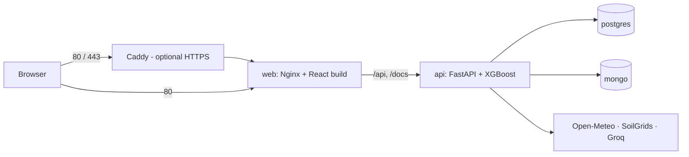

# Deployment guide (Milestone 4)

This guide covers running YieldSense AI with Docker on your own machine, deploying it to a cloud virtual machine on AWS or Azure, and the CI/CD pipeline that tests, builds and deploys it.

## Contents

1. [What is in the box](#what-is-in-the-box)
2. [Run locally with Docker](#run-locally-with-docker)
3. [Deploy to the cloud](#deploy-to-the-cloud)
4. [HTTPS with your own domain](#https-with-your-own-domain)
5. [CI/CD pipeline](#cicd-pipeline)
6. [Operations](#operations)
7. [Validation and performance](#validation-and-performance)
8. [Troubleshooting](#troubleshooting)

---

## What is in the box

| File | Purpose |
| --- | --- |
| `backend/Dockerfile` | API image: Python 3.12, FastAPI, the served XGBoost model and the reference data. Runs as a non-root user. No TensorFlow. |
| `backend/docker-entrypoint.sh` | Waits for the databases, applies migrations, seeds once, then starts the API |
| `frontend/Dockerfile`, `frontend/nginx.conf` | Web image: production build served by Nginx, which also forwards `/api` and `/docs` to the API (same origin, so no CORS) |
| `docker-compose.yml` | The full stack: PostgreSQL, MongoDB, API, web, and an optional Caddy HTTPS proxy (`--profile tls`) |
| `docker-compose.prod.yml` | Override that runs the registry images built by CI instead of building on the server |
| `.env.docker.example` | Settings for the stack; copy to `.env.docker` |
| `deploy/server-setup.sh` | One-time setup of a fresh Ubuntu VM: Docker, firewall, swap |
| `deploy/Caddyfile` | HTTPS front door with automatic Let's Encrypt certificates |
| `deploy/backup.sh` | Daily PostgreSQL and MongoDB backups with 14-day retention |
| `.github/workflows/ci.yml` | Tests, model validation, frontend checks, image build, full-stack browser and load test |
| `.github/workflows/deploy.yml` | Builds and pushes images to GitHub Container Registry, deploys to the VM, smoke-tests it |
| `scripts/validate_model.py` | Model validation gate |
| `scripts/load_test.py` | Concurrent load test |
| `scripts/create_admin.py` | Creates an administrator when demo accounts are disabled |



---

## Run locally with Docker

Requires Docker Desktop (Windows/macOS) or Docker Engine with the Compose plugin v2.24 or later (Linux).

```powershell
copy .env.docker.example .env.docker
# Edit .env.docker: set SECRET_KEY and POSTGRES_PASSWORD
#   python -c "import secrets; print(secrets.token_urlsafe(48))"
docker compose --env-file .env.docker up -d --build
```

Open http://localhost (API documentation: http://localhost/docs). The first start takes a minute or two: it creates the schema, loads the 28,242 reference rows and seeds the demo users and farms.

```powershell
docker compose --env-file .env.docker ps          # all services should be "healthy"
docker compose --env-file .env.docker logs -f api # follow the API logs (one JSON line per request)
docker compose --env-file .env.docker down        # stop (data stays in the volumes)
docker compose --env-file .env.docker down -v     # stop and delete all data
```

If port 80 is taken on your machine, set `WEB_PORT=8080` in `.env.docker` and open http://localhost:8080.

---

## Deploy to the cloud

The deployment target is one Ubuntu virtual machine running the Compose stack. It works the same on AWS and Azure. A machine with **2 vCPU and 4 GB RAM** is comfortable; 2 GB works with the swap file that the setup script adds.

### 1. Create the virtual machine

**AWS (EC2)**

1. EC2 → Launch instance → **Ubuntu Server 24.04 LTS**, type `t3.medium` (or `t3.small` for a demo).
2. Create or choose a key pair and download the `.pem` file.
3. Security group: allow **SSH (22)** from your IP, **HTTP (80)** and **HTTPS (443)** from anywhere.
4. Storage: 20 GB gp3.
5. Optional: allocate an **Elastic IP** and associate it, so the address doesn't change on restart.

**Azure (Virtual Machine)**

1. Virtual machines → Create → **Ubuntu Server 24.04 LTS**, size `Standard_B2s`.
2. Authentication: SSH public key; download the private key.
3. Inbound ports: **SSH (22), HTTP (80), HTTPS (443)**.
4. Optional: set the public IP to **Static** and give it a DNS name label.

### 2. Prepare the server (once)

```bash
ssh -i <key> ubuntu@<server-ip>          # Azure: azureuser@<server-ip>
curl -fsSL https://raw.githubusercontent.com/<owner>/<repo>/DURGA-PRASAD-A/deploy/server-setup.sh -o server-setup.sh
bash server-setup.sh
exit                                      # log in again so the docker group applies
```

Then create the settings file on the server:

```bash
ssh -i <key> ubuntu@<server-ip>
cd ~/yieldsense
nano .env.docker      # paste the contents of .env.docker.example and fill it in
```

For a real deployment, set `SEED_DEMO_DATA=false` (the demo accounts have published passwords) and `PUBLIC_URL` to the address users will open.

### 3. Configure GitHub

In the repository: **Settings → Secrets and variables → Actions**.

| Kind | Name | Value |
| --- | --- | --- |
| Secret | `DEPLOY_HOST` | The VM's public IP or DNS name |
| Secret | `DEPLOY_USER` | `ubuntu` (AWS) or `azureuser` (Azure) |
| Secret | `DEPLOY_SSH_KEY` | The full private key (contents of the `.pem` file) |
| Variable | `PUBLIC_URL` | e.g. `http://<server-ip>` or `https://your.domain` |
| Variable | `DEPLOY_ENABLED` | `true` to deploy on every push to the branch; leave unset to deploy only manually |
| Variable | `COMPOSE_PROFILES` | `tls` when using HTTPS with a domain; otherwise leave unset |

Also create an **environment** named `production` (Settings → Environments). You can add required reviewers there so each deployment waits for approval.

### 4. Deploy

**Actions → Deploy → Run workflow.** The workflow:

1. builds both images and pushes them to `ghcr.io/<owner>/yieldsense-api` and `ghcr.io/<owner>/yieldsense-web`, tagged with the commit;
2. copies the Compose files to `~/yieldsense` on the VM;
3. pulls the new images and restarts the stack, waiting until every service is healthy;
4. calls `PUBLIC_URL/api/health` until it reports `healthy`.

For a real deployment, create the first administrator:

```bash
cd ~/yieldsense
docker compose --env-file .env.docker -f docker-compose.yml -f docker-compose.prod.yml \
  exec api python scripts/create_admin.py --username <name> --email <email> --name "<Full Name>"
```

---

## HTTPS with your own domain

1. Point an **A record** for your domain (e.g. `yieldsense.example.org`) at the VM's public IP.
2. In `~/yieldsense/.env.docker` set `DOMAIN=yieldsense.example.org`, `PUBLIC_URL=https://yieldsense.example.org`, `WEB_BIND=127.0.0.1` and `WEB_PORT=8080`.
3. Set the repository variable `COMPOSE_PROFILES=tls` and `PUBLIC_URL=https://yieldsense.example.org`, then run the Deploy workflow.

Caddy obtains and renews the certificate automatically and adds HSTS.

---

## CI/CD pipeline

**CI (`ci.yml`)** runs on every push and pull request:

| Job | Steps |
| --- | --- |
| Backend | PostgreSQL and MongoDB service containers; checks the API imports no training-only libraries; pytest; model validation gate (report uploaded as an artifact) |
| Frontend | `npm ci`, typecheck, lint (warnings fail), Prettier, Vitest, production build |
| Docker | Builds both images with layer caching |
| End to end (pushes only) | Starts the full Compose stack, runs the browser test in headless Chrome for all three roles, then a 30-second load test (report uploaded as an artifact) |

**Deploy (`deploy.yml`)** runs manually, or on pushes to the deployment branch when `DEPLOY_ENABLED=true`, as described above.

---

## Operations

All commands run in `~/yieldsense` on the server. Define a shortcut first:

```bash
alias dc='docker compose --env-file .env.docker -f docker-compose.yml -f docker-compose.prod.yml'
```

| Task | Command |
| --- | --- |
| Status | `dc ps` |
| Logs | `dc logs -f api` (JSON, one line per request, with request IDs) |
| Health | `curl -s localhost/api/health` |
| System metrics | Sign in as an administrator → Users & roles → System metrics |
| Restart the API | `dc restart api` |
| Backup now | `bash deploy/backup.sh` |
| Daily backup | `crontab -e` → `0 2 * * * cd ~/yieldsense && bash deploy/backup.sh >> backups/backup.log 2>&1` |
| Restore PostgreSQL | `gunzip -c backups/<stamp>-postgres.sql.gz \| dc exec -T postgres psql -U yieldsense -d yieldsense` |
| Restore MongoDB | `dc exec -T mongo mongorestore --archive --gzip --drop < backups/<stamp>-mongo.archive.gz` |
| Roll back | Re-run the Deploy workflow on an earlier commit, or on the server: `API_IMAGE=ghcr.io/<owner>/yieldsense-api:sha-<old> WEB_IMAGE=ghcr.io/<owner>/yieldsense-web:sha-<old> dc up -d` |

The databases are not exposed outside the Docker network; only the web container (or Caddy) publishes ports.

---

## Validation and performance

```bash
python scripts/validate_model.py                 # model gate, exit code 0/1
python scripts/load_test.py --base http://<host> --users 20 --seconds 60
```

**Model validation gate.** It refits a clone of the served pipeline on 1990–2008, scores it on 2009–2013, and checks the result against thresholds. It also checks the held-out P10–P90 coverage, feature integrity against the model card, prediction sanity and single-row latency. Its R² differs slightly from the model card's because the gate fits on all of 1990–2008, while training held 15% back for interval calibration.

| Check | Threshold | Result (local, 2026-10-08) |
| --- | --- | --- |
| Temporal R² | ≥ 0.94 | 0.9545 |
| Temporal RMSE | ≤ 2,300 kg/ha | 2,028 kg/ha |
| Temporal MAE | ≤ 1,300 kg/ha | 1,080 kg/ha |
| P10–P90 held-out coverage | ≥ 0.70 | 0.745 (mean width 2,523 kg/ha) |
| Single-row latency p95 | ≤ 50 ms | 16 ms |
| Features match the card, no excluded columns | — | Pass |

**Load test** (local API, 2 workers, 10 concurrent users, 20 s): 1,333 requests, 66 requests/s, p50 143 ms, p95 249 ms, p99 344 ms, 0 errors. Results on the cloud VM will differ with its size; run the same command against it and record the numbers.

---

## Troubleshooting

| Symptom | Cause and fix |
| --- | --- |
| `set POSTGRES_PASSWORD in .env.docker` | Compose was started without `--env-file .env.docker`, or the value is empty |
| API restarts with `SECRET_KEY is required` | `APP_ENV=production` needs `SECRET_KEY` (at least 32 characters) |
| `api` stays "starting" | First start is loading data; check `dc logs api`. If it says databases are not reachable, check `dc ps` for postgres/mongo |
| Site works but no one can sign in | Demo users are not seeded when `SEED_DEMO_DATA=false`: create an administrator with `scripts/create_admin.py` |
| Soil panel shows an error for a new farm | SoilGrids is slow or down; retry later. Demo farms are pre-cached |
| Deploy fails at `docker login` | The workflow needs `packages: write` (already set) and the package must allow the repository; or make the GHCR packages public |
| `build: !reset` not understood | Docker Compose older than v2.24; upgrade the Compose plugin |
