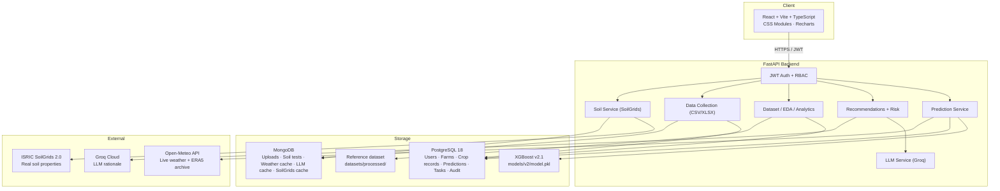

# YieldSense AI — System Architecture

> **Version**: 2.1.0 · **Branch**: `DURGA-PRASAD-A` · **Last updated**: September 2026

## High-Level Architecture

## Tech Stack

| Layer | Technology |
|-------|-----------|
| Frontend | React 19, Vite 6, TypeScript 5.8, CSS Modules, Recharts, Radix UI |
| Backend | Python 3.12, FastAPI, Uvicorn, Pydantic v2 |
| Relational DB | PostgreSQL 18 (SQLAlchemy 2.1, Alembic migrations) |
| Document DB | MongoDB (PyMongo) |
| ML Model | XGBoost 3.4 (scikit-learn pipeline, trained on FAOSTAT data) |
| Auth | JWT (PyJWT + bcrypt), role-based: Farmer / Agronomist / Admin |
| External APIs | Open-Meteo (weather), ISRIC SoilGrids (soil), Groq (LLM) |

## Database Design

See [`database-schema.md`](database-schema.md) for the full ERD (Mermaid).

### PostgreSQL Tables
- `users` — accounts with bcrypt hashes and roles
- `farms` — user-owned farms with coordinates, region, crops
- `farm_records` — per-season historical entries per farm
- `crop_records` — reference dataset (28,242 FAOSTAT rows), indexed on region/crop/year
- `predictions` — saved prediction results with model version
- `recommendation_actions` — task tracking (create/snooze/dismiss/done)
- `notifications` — deduplicated alerts with read state
- `audit_log` — admin activity log

### MongoDB Collections
- `uploads` — raw uploaded files + validation reports
- `soil_tests` — farm soil test entries
- `weather_cache` — Open-Meteo responses (TTL-indexed)
- `llm_cache` — Groq rationale cache (30-day TTL)
- `soilgrids_cache` — ISRIC soil data (180-day TTL)
- `system_metrics` — seed timing and processing speed

## ML Pipeline

- **Features**: crop_type, region, year, rainfall_mm, temperature_C, pesticide_usage_ml (6 inputs)
- **Excluded**: NDVI (target leakage), total_days (synthetic crop proxy), soil columns (synthetic)
- **Target**: yield_kg_per_hectare (raw, not log-transformed)
- **Splits**: temporal (train ≤ 2008, test 2009–2013), random, unseen-region
- **Served model**: XGBoost (raw), R² 0.953, RMSE 2,065 kg/ha on temporal split
- **Interval**: P10–P90 from temporal-split residuals; held-out coverage 74.5% (nominal 80%)
- **Model card**: `models/v2/model_card.json`

## API Structure

All routes require JWT except `/api/auth/*` and `/api/health`. Role gates:

| Route prefix | Farmer | Agronomist | Admin |
|-------------|--------|-----------|-------|
| `/api/predict` | ✅ | ✅ | ✅ |
| `/api/farms` (own) | ✅ | ✅ | ✅ |
| `/api/farms` (all) | ❌ | ✅ | ✅ |
| `/api/uploads` (crop_records) | ❌ | ✅ | ✅ |
| `/api/admin/*` | ❌ | ❌ | ✅ |

## Screens

1. **Landing** — public marketing page
2. **Sign In / Register** — full-page auth with role selection
3. **Dashboard** — KPIs, data coverage, yield ranking, recommendations
4. **Yield Predictor** — model inputs + field conditions, what-if scenarios
5. **Weather** — live forecast + yearly climate trend
6. **Soil** — real SoilGrids data + soil test ratings + crop suitability
7. **Recommendations** — AI + rule-based, with task management
8. **Analytics** — trends, farm comparison, CSV/XLSX export
9. **Dataset Explorer** — paginated records with provenance badges
10. **EDA** — distribution, scatter, crop breakdown, correlation
11. **Risk Assessment** — likelihood × impact matrix, timeline, anomalies
12. **Model Performance** — all models × 3 splits, ablation, before/after
13. **Prediction History** — server-backed, compare, re-run
14. **Farms** — CRUD + map + seasons + soil tests
15. **Data Collection** — upload wizard (CSV/XLSX)
16. **Productivity Report** — printable (/report/productivity)
17. **Notifications** — bell + page
18. **Settings** — profile, password, preferences
19. **Users & Roles** — admin only
